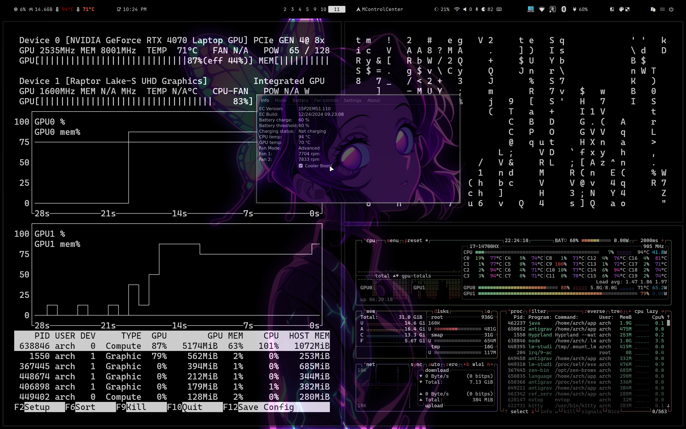

# react-test

### i wrote this .md MYSELF

## model used is "imported-models/uncategorized/Qwen2.5 Coder 7B Instruct GGUF Q5_0" https://huggingface.co/Qwen/Qwen2.5-Coder-7B-Instruct

### primary tools used are

- MINE RTX 4070 👹 + I7,14700K 👺

1. [Clion](https://www.jetbrains.com/clion/)
2. [LM studio](https://lmstudio.ai/)
   { dependencies:

- llama.cpp-linux-x86_64-vulkan-avx2
- llama.cpp-linux-x86_64-nvidia-cuda-avx2
- llama.cpp-linux-x86_64-opencl-avx2}

3. [Continue.dev extension for LLMs](https://marketplace.visualstudio.com/items?itemName=continue-dev.continue)
4. [Antigarvity](https://antigarvity.com/)
5. [gh-cli](https://cli.github.com/)
6. [github actions](https://github.com/features/actions)

#some screenshots

- Clion + Continue.dev + Qwen2.5 Coder 7B Instruct GGUF Q5_0 🦿
  
- LM studio 🛠️
  
- Max Tempratures 95C in CPU ☠️ ( it cooked my CPU fr 💔 )
  

# main changes/ problems

### used Switch to the HashRouter since GitHub pages doesn't support the tech used by the BrowserRouter.

SOLUTION INSPIRED BY https://stackoverflow.com/questions/71984401/react-router-not-working-with-github-pages

### SOLUTION: by https://stackoverflow.com/users/8690857/drew-reese

---

# Deploying to GitHub Pages

If deploying to GitHub, ensure there is a **`homepage`** entry in `package.json` for where you are hosting it on GitHub Pages.

## Examples

### User Page

```json
"homepage": "https://amodhakal.github.io"
```

### Project Page

```json
"homepage": "https://amodhakal.github.io/portfolio"
```

### Custom Domain

```json
"homepage": "https://amodhakal.com"
```

---

## Vite: Add Base

If using **Vite**, add the project directory as the `base`:

```js
// vite.config.js
export default {
  ...,
  base: "/portfolio"
};
```

---

## Switch to HashRouter

Since GitHub Pages doesn’t support BrowserRouter, use `HashRouter`.

### Standard index.js

```js
import React from "react";
import ReactDOM from "react-dom/client";
import { HashRouter } from "react-router-dom"; // Note: Use HashRouter
import App from "./App";
import "./styles/index.css";

ReactDOM.createRoot(document.getElementById("root")).render(
  <React.StrictMode>
    <HashRouter>
      <App />
    </HashRouter>
  </React.StrictMode>,
);
```

---

## React Router Data Routers

If using React Router data routers:

```js
import ReactDOM from "react-dom/client";
import App from "./App";
import { createHashRouter, RouterProvider } from "react-router-dom";

// import routed components

const router = createHashRouter([
  // … your routes configuration here
]);

const App = () => {
  return <RouterProvider router={router} />;
};

export default App;
```

---

## Reference

For more details, see the Create React App docs for deploying to GitHub Pages and notes on client-side routing.
